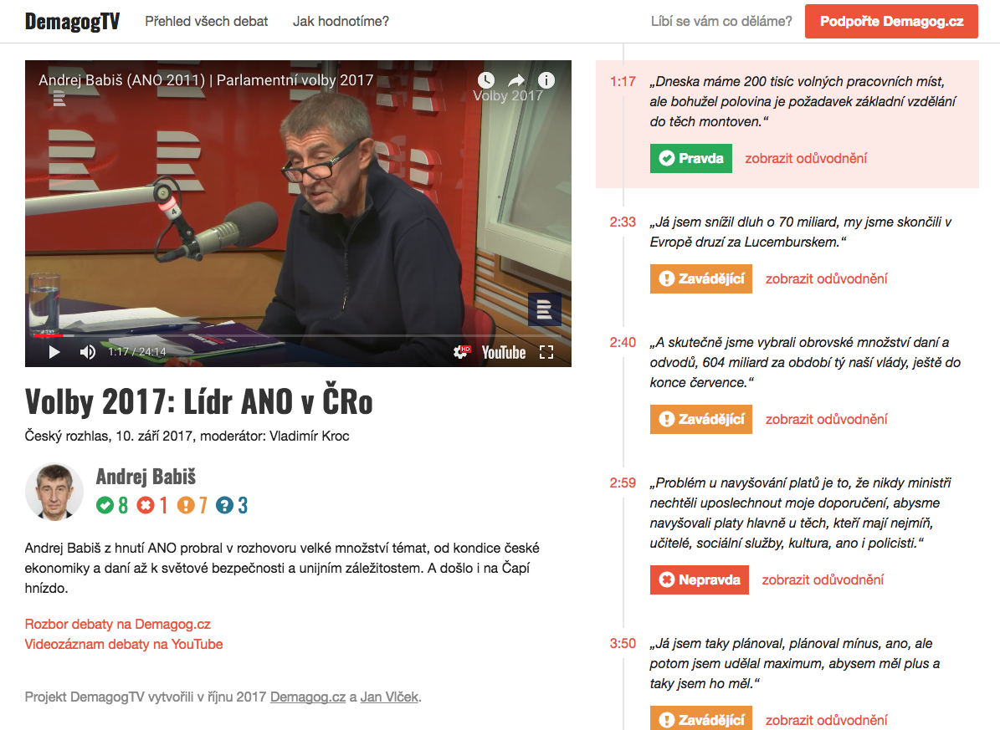

# DemagogTV

Sledujte rozhovor a zároveň, zda politik říká pravdu či ne. Propojili jsme
videozáznamy debat s výroky tak, že v čase vyřčení naskočí hodnocení od
[Demagog.cz](http://demagog.cz). [https://demagogtv.cz](https://demagogtv.cz)

*[Go to description in English](#project-description)*



## Technologie

* UI postaveno v Reactu
* Server je v Express nad Node.js a předrendrovává UI (server-side rendering)
* Běží na DigitalOcean

## Spuštění lokálně

Pouze klient:

```
git clone git@github.com:vlki/demagogtv.git
cd demagogtv
yarn install
yarn run start
```

I se serverem:

```
git clone git@github.com:vlki/demagogtv.git
cd demagogtv
yarn install
yarn run build
yarn run server
```

## Licence

* Data o výrocích a obrázky patří projektu [Demagog.cz](http://demagog.cz)
* Kód je pod licencí [MIT](LICENSE.md)

---

## Project description

Integration of political debate video with factchecking so the viewer can watch the debate and see the checked facts from Czech factchecking organization [Demagog.cz](http://demagog.cz) at the same time.

See screenshot above for demonstration (video on the left, checked facts on the right).
